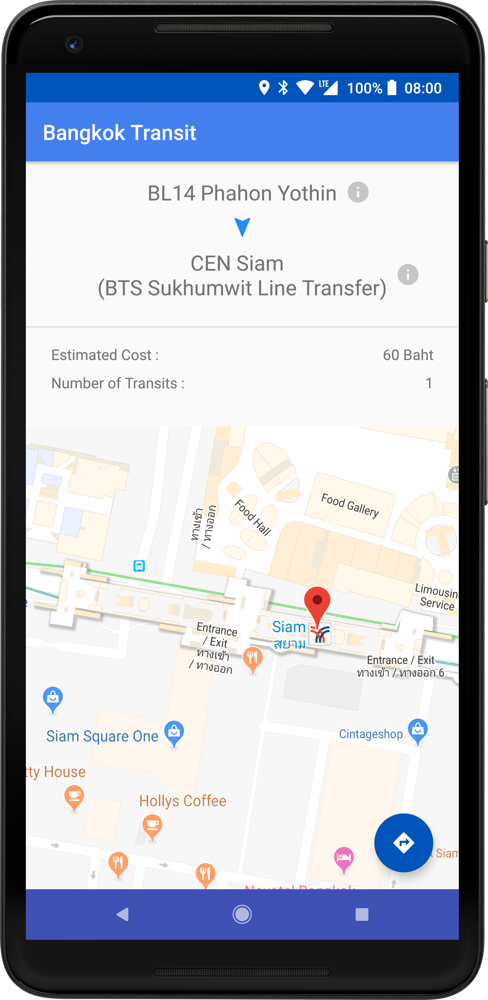

# Bangkok Transit

The goal of this app is to create a clean & easy to use material-designed transit app for Bangkok's metro system, that also has all the necessary features, to help out the tourists that came to visit Bangkok, Thailand.

# Features

  - Bangkok Transit app includes all three main metro transportation systems in Bangkok: Airport Rail Link, BTS Skytrain, and MRT.  
  - Station information with small details for every station, such as Number of exits and Platforms information.
  - Choose origin and destination stations to see details of the trip between these two stations, such as Estimated cost and number of transits required. Implemented using Dijkstra's algorithm.
  - Google Map integration allows the app to access the indoor map of the stations, as well as an ability to navigate users to the selected station.
  - Detect nearby stations for easy access.
  - Overall transit map of Bangkok metro transit system.
  - Time Schedules for each transit system.

# Screenshots
      

Created by Namtalay L.
